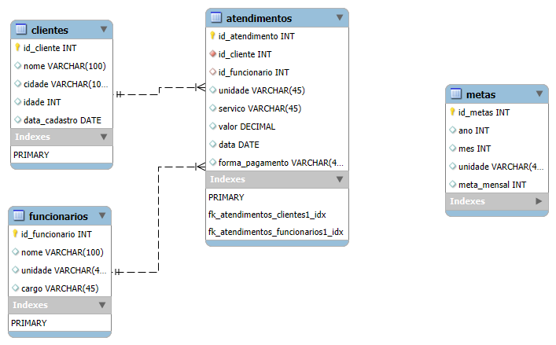
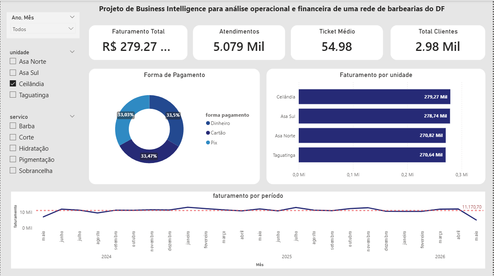
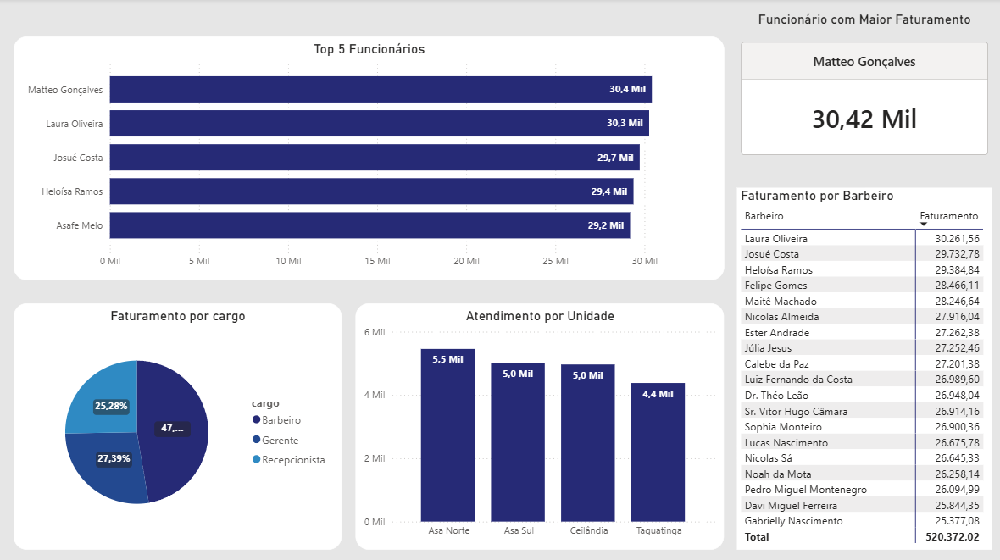
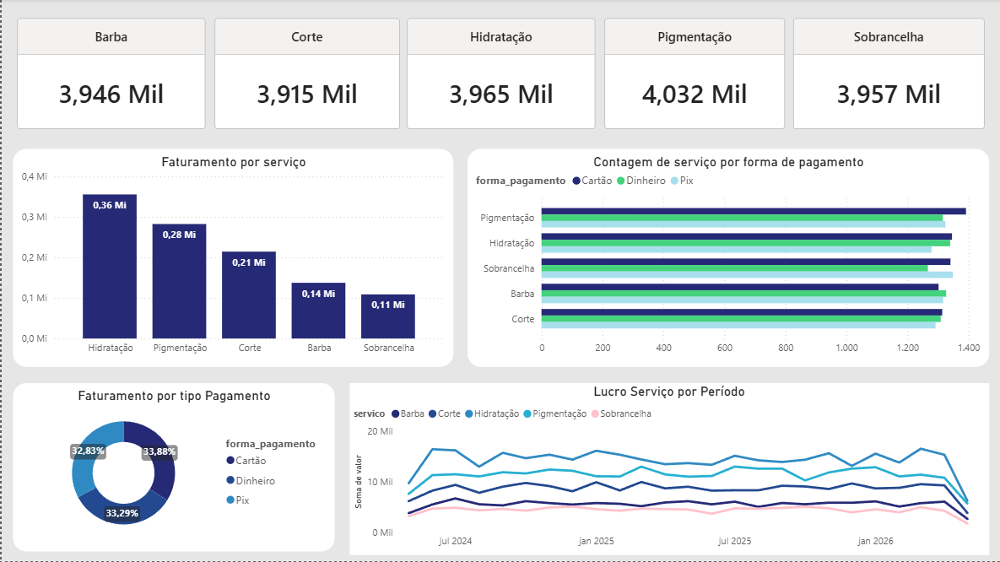

README.md
# BarberBI: Análise de Business Intelligence para Barbearias

## Descrição do Projeto

O projeto **BarberBI** é uma solução de Business Intelligence (BI) desenvolvida para fornecer análises operacionais e financeiras detalhadas para uma rede de barbearias no Distrito Federal. O objetivo principal é transformar dados brutos em insights acionáveis, permitindo que os gestores tomem decisões estratégicas baseadas em informações concretas para otimizar o desempenho do negócio.

## Funcionalidades

- **Extração, Transformação e Carga (ETL)**: Processamento de dados brutos de atendimentos, clientes, funcionários e metas.
- **Modelagem de Dados**: Criação de um modelo de dados relacional otimizado para análise.
- **Análise de Dados**: Exploração e análise aprofundada dos dados para identificar tendências e padrões.
- **Visualização Interativa**: Dashboards dinâmicos desenvolvidos no Power BI para monitoramento de KPIs e métricas de desempenho.

## Estrutura do Projeto

O projeto está organizado nas seguintes pastas:

- `Banco/`: Contém o modelo conceitual do banco de dados e o script SQL para criação das tabelas.
- `Dados Limpos/`: Armazena os arquivos CSV com os dados após o processo de limpeza e tratamento.
- `Dashboard/`: Inclui o arquivo `.pbix` do Power BI e as capturas de tela do dashboard.
- `ETL e Analise/`: Contém os notebooks Jupyter para exploração, limpeza e análise dos dados, além dos dados brutos.

### Banco de Dados

O modelo de dados relacional foi projetado para armazenar informações sobre clientes, funcionários, atendimentos e metas. A estrutura garante a integridade e a facilidade de consulta dos dados.



### ETL e Análise

Os notebooks Jupyter (`Exploração_LimpesaBarber.ipynb` e `AnaliseBarber.ipynb`) detalham as etapas de:

1.  **Coleta de Dados**: Importação de arquivos CSV brutos.
2.  **Limpeza e Pré-processamento**: Tratamento de valores ausentes, remoção de duplicatas e padronização de formatos.
3.  **Transformação**: Criação de novas features e agregação de dados para análise.
4.  **Análise Exploratória**: Geração de gráficos e estatísticas para entender a distribuição e o relacionamento entre as variáveis.

### Dashboard

O dashboard interativo no Power BI oferece uma visão abrangente do desempenho da barbearia, com foco em métricas chave como:

- Faturamento Total, Atendimentos, Ticket Médio e Total de Clientes.
- Distribuição de Faturamento por Forma de Pagamento e por Unidade.
- Desempenho dos Funcionários (Top 5 em Faturamento).
- Comparativo de Faturamento vs. Metas por Período.

#### Visão Geral do Dashboard



#### Desempenho de Funcionários



#### Faturamento vs. Metas



## Tecnologias Utilizadas

- **Python**: Para ETL e análise de dados (com bibliotecas como `pandas` e `matplotlib`).
- **Jupyter Notebook**: Para desenvolvimento e documentação das etapas de ETL e análise.
- **MySQL Workbench**: Para modelagem do banco de dados.
- **Power BI**: Para criação dos dashboards interativos.

## Como Visualizar o Projeto

Para explorar este projeto, siga os passos:

1.  **Clone o Repositório**:
    ```bash
    git clone https://github.com/seu-usuario/BarberBI.git
    cd BarberBI
    ```
2.  **Banco de Dados**: Utilize o script `SQL_barber.sql` na pasta `Banco/` para criar o esquema do banco de dados em um ambiente MySQL.
3.  **ETL e Análise**: Abra os notebooks Jupyter na pasta `ETL e Analise/` para revisar o processo de tratamento e análise dos dados. Certifique-se de ter as bibliotecas Python necessárias instaladas (`pandas`, `matplotlib`).
4.  **Dashboard**: Abra o arquivo `barbaeDashboard.pbix` na pasta `Dashboard/` com o Power BI Desktop para interagir com o dashboard e explorar os insights.

## Resultados e Insights

O projeto BarberBI permite identificar:

- As unidades com maior e menor faturamento.
- As formas de pagamento mais utilizadas pelos clientes.
- Os funcionários com melhor desempenho em termos de faturamento e atendimentos.
- Acompanhamento do faturamento em relação às metas estabelecidas, permitindo ajustes estratégicos.

Filipe Fogaça
